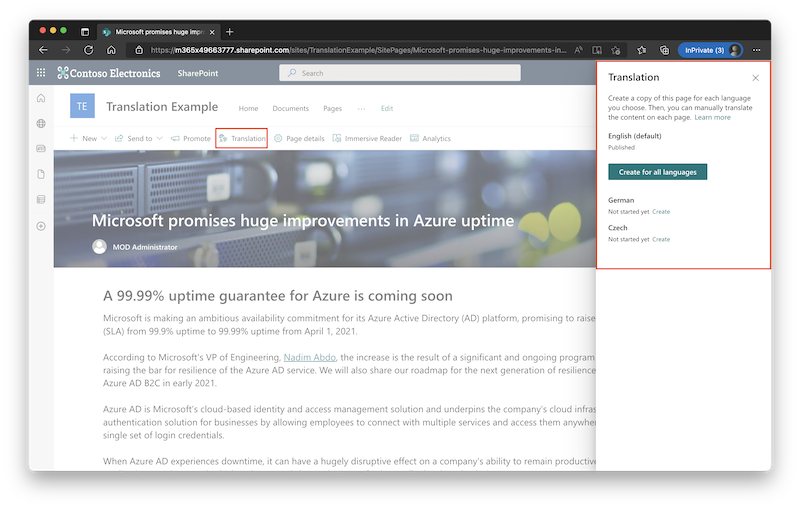
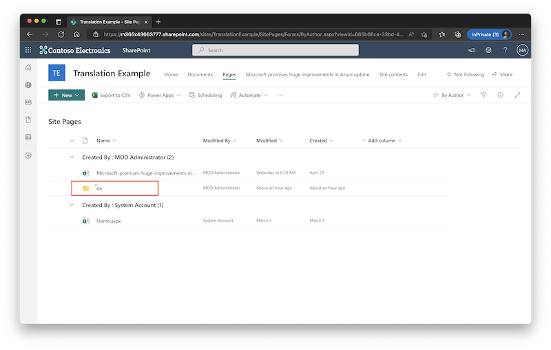
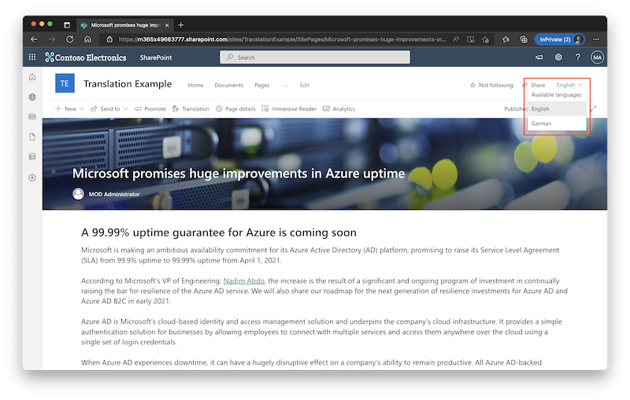
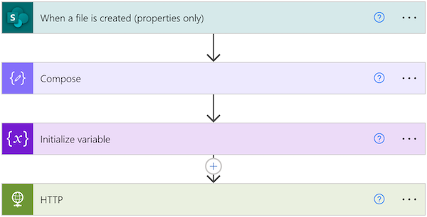
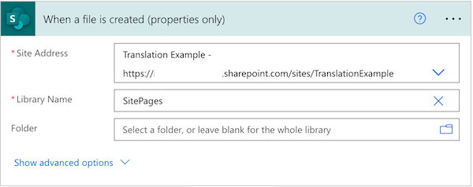
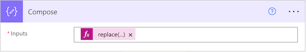
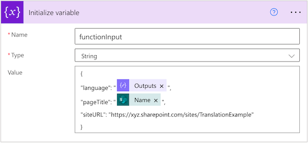
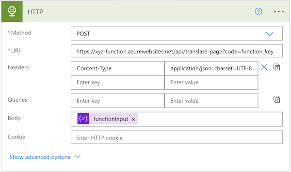

# SharePoint: Automatic Site Pages translation to different languages

This manual describes how to set up automatic translation of site pages in SharePoint. 

# How it works?

SharePoint multilingual feature enables management of site page translations. It adds new button `Translation` where pre-defined language translation can be created. 



When a translation is created, a copy of the site page is created in corresponding subfolder...



...and select menu allows to switch between different translations of the site page.



By default, each translation must be translated and published manually. By creating a SharePoint Flow and [Azure Function](https://azure.microsoft.com/en-in/services/functions/#overview), it may be automatically translated using [Azure Translator](https://azure.microsoft.com/en-us/services/cognitive-services/translator/#overview) and published for the audience.

# What is needed?

1. [SharePoint multilingual feature](#1-sharepoint-multilingual-feature)
2. [Azure Active Directory application registration](#2-azure-active-directory-application-registration)
3. [Azure Conginite Services: Translator](#3-azure-translator)
4. [Azure Function App](#4-azure-function-app)
5. [SharePoint Flow](#5-sharepoint-flow)

# Installation

## 1. SharePoint multilingual feature

Enable SharePoint multilingual feature as defined in [documentation](https://support.microsoft.com/en-us/office/create-multilingual-communication-sites-pages-and-news-2bb7d610-5453-41c6-a0e8-6f40b3ed750c).

Note down your SharePoint tenant e.g., `xyz.onmicrosoft.com`.

### 2. Azure Active Directory application registration

#### Interactive way

Add application registration as defined in [documentation](https://docs.microsoft.com/en-us/sharepoint/dev/solution-guidance/security-apponly-azuread). This app registration will be used by Azure Function App to connect to SharePoint and read/write translated site pages.

> **_NOTE:_** Certificate is needed to access SharePoint from Azure Function App, Password is not enough.

Once app registration and certificate is created, go to this registration and note down `Application (client) Id` (to be found in `Application > Overview`) and save Certificate used in credentials.

Go to `Manage > API Permissions` and check if sucessful right are delegated to app registration.

#### Command line way

Add application registration using following PowerShell commands from [PnP PowerShell](https://pnp.github.io/powershell/articles/authentication.html#setting-up-access-to-your-own-azure-ad-app) module.

First install PnP PowerShell module:

```PowerShell
Install-Module -Name "PnP.PowerShell"
```

Then add application registration and follow the instruction:

```PowerShell
$result = Register-PnPAzureADApp -ApplicationName "YOUR_APP_NAME" -Tenant YOURTENANT.onmicrosoft.com -OutPath c:\mycertificates -DeviceLogin
```

Last, display and note down base 64 encoded certificates private key:

```PowerShell
$result.Base64Encoded
```

## 3. Azure Translator

Deploy (create) Translator from Azure Cognitive Services into your Azure Subscription. 

Once Translator is deployed, go to this resource in Azure Portal and note down `Key` and `Location/Region` (to be found under `Resource Management > Keys and Endpoint`).

## 4. Azure Function App

### Create Function App

Deploy (create) Function App into your Azure Subscription.

Use following properties/values when creating Function App:

Property | Value
---|---
Publish|Code
Runtime stack|PowerShell Core
Plan type|Consumption (Serverless)*

\* Select according to your planned load

### Function App Configuration

Once Function App is deployed, go to this resource in Azure Portal, select `Settigns > Configuration` and add following environment properties (case sensitive):

Property | Value
---|---
ClientId|`Application (client) Id` from [AD application registration](#2-azure-active-directory-application-registration)
ClientSecret|Base64 encoded certificate's PFX file with private key or PnpPowerShell registration Base64 encoded private key  from [AD application registration](#2-azure-active-directory-application-registration) step
TranslatorKey|`Key` from [Translator](#3-azure-translator)
TranslatorRegion|`Location/Region` from [Translator](#3-azure-translator)
Tenant|SharePoint tenant (e.g. `xyz.onmicrosoft.com`)

Open `Functions > App files` and select `requirements.psd1` from select box. Copy code from [`function/requirements.psd1`](function/requirements.psd1) and paste it into Azure Portal.

> **_NOTE:_** Don't forget to save changes.

### Create function

In Function App resource in Azure Portal, select `Functions > Functions` and then `Create`.

Use following properties/values when creating function:

Property | Value
---|---
Development env.|Develop in portal
Template|HTTP trigger
Authorization level|Function

Once function is created, function detail will be automatically opened. In `Overview` click on `Get Function Url` button and note down this URL. 

### Function Code

Open `Developer > Code + Test` and select `run.ps1` from select box. Copy code from [`function/run.ps1`](function/run.ps1) and paste it into Azure Portal.

Choose `function.json` from select box and copy code from [`function/function.json`](function/function.json) and paste it into Azure Portal.

> **_NOTE:_** Don't forget to save changes.

## 5. SharePoint Flow

Open the site in SharePoint and select `Pages` from top menu. Now from second level top menu open `Automate > Power Automate > See your flows`.

### Create connection

> **_NOTE:_** If you already have existing SharePoint connection, you can skip this step.

From left menu open `Data > Connections` and from top menu click on `New connection`. Now choose `SharePoint` and create it.

### Create Flow

From left menu open `My flows` and from top menu open `New flow > Automated cloud flow`. Select `When a file is created (properties only)` and create.

Entire flow has 4 steps:



#### 1. When a file is created (properties only)

First step is the trigger when the flow starts.



Choose `Site Address` as the site where you want to enable translations and `Library Name` set to `Site Pages` (we want to translate only site pages).

As we want to translate only site pages created for translations, we'll be watching for `OData__SPIsTranslation` property with value `true`. Original (main language) pages have this property set to `false`.

Open step menu (three dots in top right corner) and click on `Settings`. Add new `Trigger Condition` with following value:

```
@equals(triggerBody()?['OData__SPIsTranslation'],true)
```

#### 2. Compose

Folder name equals to the translator language code and we can extract it from the site page path. 



Add following expression into `Inputs`:

```
replace(replace(triggerBody()?['{Path}'],'SitePages',''),'/','')
```

#### 3. Initialize variable

Let's prepare JSON input for our [Azure Function App](#4-azure-function-app). Input has following structure:

```JSON
{
	"language": "language-code-extracted-in-previous-step",
	"pageTitle": "name-of-a-site-page",
	"siteURL": "your-sharepoint-site-url (e.g. xyz.sharepoint.com/site/CoolSite)"
}
```

For `language` use output from previous step, for `pageTitle` use dynamic content `Name` and `siteURL` is hard coded:



#### 4. HTTP

Last step is to call the [Azure Function App](#4-azure-function-app). 



Use following properties/values for HTTP step:

Property | Value
---|---
Method|POST
URI|`Function URL` from [Create function](#create-function)
Headers|<table><thead><tr><th>Key</th><th>Value</th></tr></thead><tbody><tr>  <td>Content-Type</td><td>application/json; charset=UTF-8</td></tr></tbody></table>  
Body|Output from previous step

> **_NOTE:_** Don't forget to save changes.

# Run

When everything is installed and configured, now in SharePoint site page when clicking on `Translate` button in top menu, dialog with translations will open. 

Clicking on `Create` for given language will create a copy of current site page and initiate automatic translation. 

After couple of seconds (minutes, depending on load), site page translation will be translated and content in different language can be accessed via top right select menu.

# Troubleshooting

Go to SharePoint flow to access logs of the flow or to Azure Function and select `Monitor` to access logs of the function.

# Limitations

SharePoint multilingual feature is available only for Communicaion Sites (not for Team Sites).

# License

Distributed under MIT License. See [LICENSE](LICENSE) for more details.

# Thanks

This manual is based on work of [Michal Sacewicz](https://michalsacewicz.com/automatically-translate-news-on-multilingual-sharepoint-sites/).